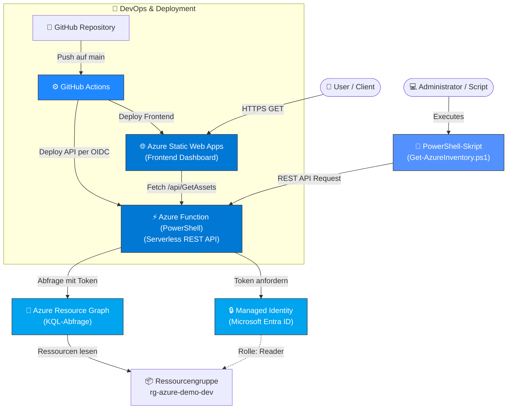

# ☁️ Azure Cloud Asset Management & Dashboard

[](https://azure.microsoft.com/)
[](https://azure.microsoft.com/)
[](https://github.com/features/actions)

Ein serverloses Dashboard, das die Azure-Ressourcen einer Ressourcengruppe live anzeigt. Eine **Azure Function in PowerShell** liest sie per **Managed Identity** mit der Rolle *Reader* über **Azure Resource Graph** aus. Das Projekt zeigt Serverless-Architektur, Zugriffssteuerung mit RBAC und Deployment per CI/CD ohne gespeicherte Passwörter.

🚀 **Live-Demo:** https://gray-stone-09ea0b410.7.azurestaticapps.net

> Beim ersten Aufruf kann es einige Sekunden dauern, weil die Function aus dem Leerlauf startet (Cold Start).

---

## 🏗️ Architektur & Komponenten

1. **Frontend:** Gehostet auf **Azure Static Web Apps**. Das Dashboard hat Live-Suche, Kategorie-Filter und Statusanzeigen.
2. **Backend API:** **Azure Function (PowerShell)** im Verbrauchsplan mit dem Endpunkt `/api/GetAssets`. Sie fragt Azure Resource Graph (KQL) ab und gibt pro Ressource nur Name, Kategorie, Status und eine gekürzte ID zurück. Die Subscription-ID wird nicht ausgeliefert. Das Ergebnis wird 60 Sekunden zwischengespeichert, weil Resource Graph pro Benutzer gedrosselt wird.
3. **Automatisierung:** Das PowerShell-Skript `scripts/Get-AzureInventory.ps1` fragt die API mit Retry ab und kann die Assets als CSV exportieren.
4. **CI/CD:** Zwei **GitHub-Actions**-Workflows deployen Frontend und API bei jedem Push auf `main`.

---

## 🔐 Zugriffssteuerung (RBAC) & Sicherheit

- **Managed Identity:** Die Function hat eine systemzugewiesene Identität. Im Code stehen keine Zugangsdaten.
- **Least Privilege:** Die Identität hat nur die Rolle **Reader** und nur auf die eine Ressourcengruppe, nicht auf das ganze Abonnement.
- **OIDC statt Passwort:** Die API-Pipeline meldet sich über eine Federated Credential (GitHub → Microsoft Entra ID) an. Es liegt kein Secret im Repository. Die dafür angelegte App-Registrierung hat die Rolle *Website Contributor* nur auf die Function App.
- **CORS:** Die Function akzeptiert nur Anfragen von der Domain des Dashboards.
- **HTTP-Header:** `staticwebapp.config.json` setzt grundlegende Sicherheits-Header.

Die einzelnen Schritte stehen in [`docs/RBAC-SETUP.md`](docs/RBAC-SETUP.md).

---

## 🛠️ Verwendete Technologien

- **Cloud & Identity:** Microsoft Azure (Static Web Apps, Functions, Resource Graph, Managed Identity, Entra ID, RBAC)
- **Programmierung & Automatisierung:** PowerShell (Function und Skripte), JavaScript (async/await), HTML5/CSS3, KQL
- **DevOps:** GitHub Actions (OIDC), Git
- **Zertifizierungen:** Microsoft Certified: Azure Fundamentals (AZ-900) | AZ-104 in Vorbereitung

---

## ⚡ Cold-Start & Resilience

Azure Functions im Verbrauchsplan werden bei Inaktivität heruntergefahren. Das Frontend wiederholt deshalb fehlgeschlagene Anfragen bis zu fünfmal mit steigender Wartezeit und zeigt dabei den Versuch an. Das PowerShell-Skript wiederholt Anfragen mit verdoppelter Wartezeit. Liefert Resource Graph keine Antwort, gibt die Function die zuletzt bekannten Daten zurück, solange sie welche hat.

---

## 📁 Projektstruktur

```
.github/workflows/   Pipelines für Frontend und API
api/GetAssets/       Azure Function (PowerShell)
scripts/             PowerShell-Skript zur API-Abfrage
docs/                Einrichtung von Managed Identity, Reader-Rolle und OIDC
index.html           Dashboard (Frontend)
staticwebapp.config.json
```

---

## 🧪 Lokal ausprobieren

1. Repository klonen: `git clone https://github.com/enes568/azure-asset-management.git`
2. `index.html` im Browser öffnen. Das Dashboard ruft die produktive API ab.
3. API per Skript abfragen: `.\scripts\Get-AzureInventory.ps1` (optional `-ExportCsv .\assets.csv`)

---

## ⚠️ Bekannte Grenzen

- Das Dashboard ist öffentlich und nur lesend. Eine Benutzeranmeldung mit eigenem Entra-ID-Login wäre in Static Web Apps nur im kostenpflichtigen Standard-Plan möglich.
- Als Status steht der Laufzustand bzw. der `provisioningState` der Ressource, nicht jede Ressource liefert einen.
- Geplant: die Ressourcen als Infrastructure as Code (Bicep) beschreiben.

---

## 👤 Autor

**Enes Can**  
*IT-Systemtechniker mit Schwerpunkt Azure (AZ-900)*

---

## 📐 Cloud-Systemarchitektur


